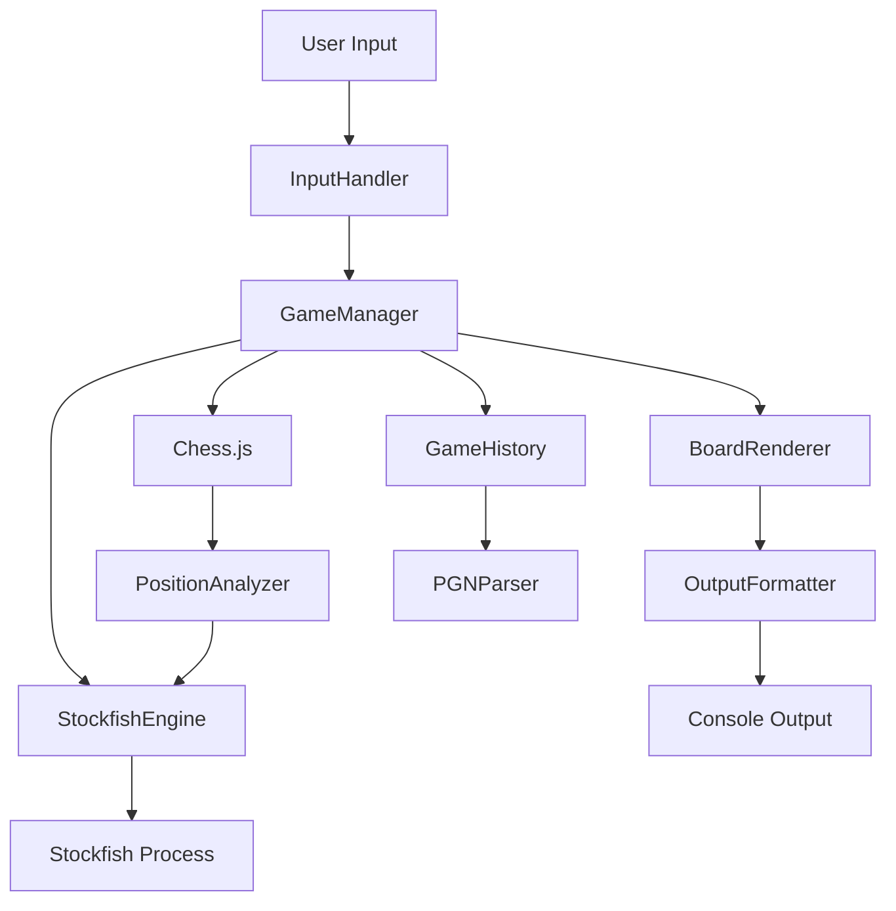

# Chess Helper - Analysis & Improvement Plan

## Current State Analysis

The script is a CLI chess assistant that:

- Uses Stockfish engine for move suggestions
- Supports manual input of both player and opponent moves
- Provides basic game state validation
- Tracks game-over conditions

## Critical Issues & Bugs

### 1. **Race Condition in Engine Initialization**

The engine may not be ready when first move is requested. No wait for `engineReady` flag.

```72:94:index.js
(async function main() {
  console.log("\n♟ Chess Move Helper\n");

  const colour = (
    await ask("Are you playing white or black? (w/b): ")
  ).toLowerCase();
  // ... immediately calls getBestMove without checking engineReady
```

### 2. **Message Handler Race Condition**

Multiple simultaneous `getBestMove` calls would overwrite `messageHandler`, causing lost responses.

```56:70:index.js
function getBestMove(fen) {
  return new Promise((resolve) => {
    // ... messageHandler is a shared global variable
    messageHandler = (line) => {
      // Can be overwritten by another call
```

### 3. **Turn Order Logic Flaw**

If playing as black, the script still asks for your move first instead of opponent's move.

```92:98:index.js
while (!game.isGameOver()) {
  // Always asks for player move first, regardless of color
  const suggestedMove = await getBestMove(game.fen());
  const myMove = await ask(`Your move (suggested: ${suggestedMove}): `);
```

### 4. **No Error Handling for Engine Crashes**

If Stockfish process dies, the app hangs indefinitely.

## Code Quality Improvements

### 1. **Error Handling**

- Add try-catch blocks around engine communication
- Handle engine process crashes gracefully
- Add timeout for engine responses
- Validate FEN strings before sending to engine

### 2. **Code Organization**

- Extract engine management into a class (`StockfishEngine`)
- Separate game logic from UI/input handling
- Create configuration constants (depth, timeouts, etc.)
- Add JSDoc comments for functions

### 3. **Input Validation**

- Validate move format before attempting to apply
- Provide better error messages with examples
- Support additional move formats (e.g., "e2e4", "e4", "Nf3")

### 4. **Resource Management**

- Ensure engine process cleanup on all exit paths
- Handle SIGINT/SIGTERM for graceful shutdown
- Add process exit handlers

## New Features

### 1. **Board Visualization**

Display ASCII board after each move for better game tracking.

```
  a b c d e f g h
8 ♜ ♞ ♝ ♛ ♚ ♝ ♞ ♜
7 ♟ ♟ ♟ ♟ ♟ ♟ ♟ ♟
6 . . . . . . . .
5 . . . . . . . .
4 . . . . . . . .
3 . . . . . . . .
2 ♙ ♙ ♙ ♙ ♙ ♙ ♙ ♙
1 ♖ ♘ ♗ ♕ ♔ ♗ ♘ ♖
```

### 2. **Move History & Navigation**

- Display move history in algebraic notation
- Support undo/redo functionality
- Export game to PGN format
- Load game from PGN

### 3. **Enhanced Analysis Features**

- Show evaluation score (centipawns)
- Display top 3 move alternatives with evaluations
- Configurable engine depth/time
- Show principal variation (PV)
- Highlight tactical opportunities (checks, captures, threats)

### 4. **Position Analysis Mode**

- Analyze specific positions from FEN
- Skip to any move number
- Set up custom positions
- Load positions from FEN strings

### 5. **Game Modes**

- **Training Mode**: Puzzle positions with solutions
- **Analysis Mode**: Computer plays both sides with explanations
- **Hint Mode**: Progressive hints (weak → strong)
- **Blunder Check**: Warn before making poor moves

### 6. **Configuration & Preferences**

- Save/load settings (engine depth, display preferences)
- Adjustable difficulty levels
- Color scheme preferences
- Sound notifications (optional)

### 7. **Statistics & Tracking**

- Track games played
- Win/loss/draw statistics
- Average move quality
- Opening repertoire tracking
- Mistake/blunder counts

### 8. **Opening Book Integration**

- Show opening names
- Suggest book moves in opening phase
- Display opening statistics
- Link to opening theory resources

### 9. **Better UX Enhancements**

- Command shortcuts (`h` for help, `b` for board, `u` for undo)
- Move suggestions with explanations
- Highlight last move on board
- Show captured pieces
- Display material advantage
- Time tracking per move
- Confirmation for potentially bad moves

### 10. **Import/Export Features**

- Load games from Chess.com/Lichess
- Export to multiple formats (PGN, FEN, JSON)
- Save/resume games
- Share position links

## Architecture Improvements

### Proposed Structure

```
chess-helper/
├── src/
│   ├── engine/
│   │   ├── StockfishEngine.js      # Engine wrapper class
│   │   └── EngineConfig.js         # Engine configuration
│   ├── game/
│   │   ├── GameManager.js          # Game state management
│   │   ├── MoveValidator.js        # Move validation logic
│   │   └── GameHistory.js          # Move history tracking
│   ├── ui/
│   │   ├── BoardRenderer.js        # ASCII board display
│   │   ├── InputHandler.js         # User input processing
│   │   └── OutputFormatter.js      # Formatted output
│   ├── analysis/
│   │   ├── PositionAnalyzer.js     # Position evaluation
│   │   └── MoveExplainer.js        # Move explanation logic
│   ├── utils/
│   │   ├── PGNParser.js            # PGN import/export
│   │   ├── FENValidator.js         # FEN validation
│   │   └── Logger.js               # Logging utility
│   └── index.js                     # Main entry point
├── config/
│   └── default.json                # Default configuration
├── tests/
│   └── ...                         # Unit tests
├── package.json
└── README.md
```

### Data Flow



## Implementation Priority

### Phase 1: Critical Fixes (High Priority)

1. Fix engine initialization race condition
2. Fix turn order for black pieces
3. Add engine crash handling
4. Implement proper cleanup handlers

### Phase 2: Code Quality (Medium Priority)

1. Refactor into modular architecture
2. Add comprehensive error handling
3. Improve input validation
4. Add JSDoc documentation

### Phase 3: Core Features (Medium Priority)

1. Board visualization
2. Move history display
3. Enhanced analysis (eval scores, alternatives)
4. Undo/redo functionality

### Phase 4: Advanced Features (Lower Priority)

1. PGN import/export
2. Multiple game modes
3. Configuration system
4. Statistics tracking
5. Opening book integration

## Testing Strategy

- Unit tests for game logic
- Integration tests for engine communication
- End-to-end tests for user workflows
- Mock Stockfish for faster tests
- Test edge cases (stalemate, threefold repetition, 50-move rule)

## Dependencies to Add

```json
{
  "chalk": "^5.3.0", // Terminal colors
  "commander": "^12.0.0", // CLI argument parsing
  "conf": "^12.0.0", // Configuration management
  "ora": "^8.0.1", // Loading spinners
  "boxen": "^7.1.1", // Boxed messages
  "table": "^6.8.1" // Formatted tables
}
```

## Documentation Needs

- README with usage examples
- API documentation for modules
- Configuration guide
- Contributing guidelines
- Troubleshooting guide
