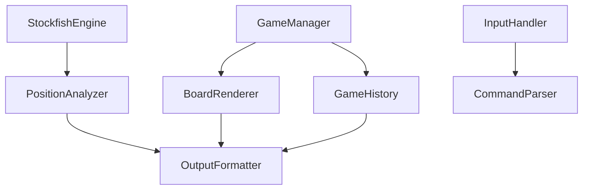

# Phase 3: Core Features Implementation

## Overview

Phase 3 adds essential chess analysis features to enhance the user experience: visual board display, move history navigation, and detailed position analysis with engine evaluations.

## Architecture Changes

### New Components



### New Files to Create

1. **[src/ui/BoardRenderer.js](src/ui/BoardRenderer.js)** - ASCII board visualization with Unicode chess pieces
2. **[src/game/GameHistory.js](src/game/GameHistory.js)** - Move history tracking, undo/redo functionality
3. **[src/analysis/PositionAnalyzer.js](src/analysis/PositionAnalyzer.js)** - Enhanced position analysis with evaluation scores
4. **[src/ui/CommandParser.js](src/ui/CommandParser.js)** - Parse special commands (undo, board, history, etc.)

### Files to Modify

1. **[src/game/GameManager.js](src/game/GameManager.js)** - Integrate GameHistory, add undo/redo methods
2. **[src/engine/StockfishEngine.js](src/engine/StockfishEngine.js)** - Add evaluation score extraction from UCI info lines
3. **[src/ui/OutputFormatter.js](src/ui/OutputFormatter.js)** - Add methods for board, history, and analysis display
4. **[src/ui/InputHandler.js](src/ui/InputHandler.js)** - Integrate CommandParser for special commands
5. **[src/index.js](src/index.js)** - Update game loop to handle new commands and display features

## Feature Details

### 1. Board Visualization

**Display Format:**

```
  a b c d e f g h
8 ♜ ♞ ♝ ♛ ♚ ♝ ♞ ♜
7 ♟ ♟ ♟ ♟ ♟ ♟ ♟ ♟
6 · · · · · · · ·
5 · · · · · · · ·
4 · · · · ♙ · · ·
3 · · · · · · · ·
2 ♙ ♙ ♙ ♙ · ♙ ♙ ♙
1 ♖ ♘ ♗ ♕ ♔ ♗ ♘ ♖
```

**Features:**

- Unicode chess pieces (♔♕♖♗♘♙ for white, ♚♛♜♝♞♟ for black)
- Coordinate labels (a-h, 1-8)
- Highlight last move with different background/markers
- Display captured pieces below board
- Show material advantage (e.g., "+2" for white)

**Implementation in BoardRenderer.js:**

- `static renderBoard(game, lastMove)` - Main rendering method
- `static getPieceSymbol(piece)` - Map chess.js pieces to Unicode
- `static highlightSquare(square, lastMove)` - Mark last move
- `static getCapturedPieces(game)` - Track captured pieces
- `static getMaterialAdvantage(game)` - Calculate material difference

### 2. Move History

**Display Format:**

```
Move History:
1. e4 e5
2. Nf3 Nc6
3. Bb5 a6
4. Ba4 Nf6
5. O-O Be7
```

**Features:**

- Standard algebraic notation (SAN)
- Numbered move pairs (white/black)
- Undo/redo navigation
- Export to PGN format
- Display specific position from history

**Implementation in GameHistory.js:**

- `addMove(move, fen)` - Record move with position
- `undo()` - Go back one move, return previous FEN
- `redo()` - Go forward one move if available
- `getMoveHistory()` - Get formatted move list
- `canUndo()` / `canRedo()` - Check navigation availability
- `toPGN()` - Export game to PGN format
- `clear()` - Reset history

### 3. Enhanced Analysis

**Display Format:**

```
Position Evaluation: +0.45 (White is slightly better)

Top 3 Moves:
1. Nf3 (+0.45) - Develops knight, controls center
2. d4 (+0.38) - Opens center, fights for space
3. c4 (+0.35) - English opening, flexible setup
```

**Features:**

- Centipawn evaluation from Stockfish
- Multiple move alternatives (top 3-5)
- Evaluation for each alternative
- Simple position assessment (winning, equal, losing)
- Tactical hints (check, capture, threat)

**Implementation in PositionAnalyzer.js:**

- `async analyzePosition(engine, fen, depth)` - Get full analysis
- `async getTopMoves(engine, fen, numMoves, depth)` - Get multiple alternatives
- `formatEvaluation(centipawns)` - Convert to readable format (+0.45)
- `getPositionAssessment(centipawns)` - Describe position (winning/equal/losing)
- `static explainMove(move, game)` - Basic move explanation

**Engine Enhancement:**

- Modify `StockfishEngine.getBestMove()` to also return evaluation score
- Add `StockfishEngine.getAnalysis()` method that returns multiple moves with scores
- Parse UCI "info" lines for "score cp" (centipawns) and "multipv" (multiple variations)

### 4. Command System

**New Commands:**

- `board` or `b` - Display current board position
- `history` or `h` - Show move history
- `undo` or `u` - Undo last move (both player and opponent)
- `redo` or `r` - Redo undone move
- `analyze` or `a` - Deep analysis of current position
- `help` or `?` - Show available commands
- `quit` or `q` - Exit game

**Implementation in CommandParser.js:**

- `static isCommand(input)` - Check if input is a command
- `static parseCommand(input)` - Parse command and arguments
- `static getCommandHelp()` - Return help text for all commands

### 5. Auto-Confirm Suggested Move

**Feature:**

When the player is prompted for their move, pressing Enter on an empty input (without typing anything) will automatically use the suggested move from Stockfish.

**User Experience:**

```
Your move (suggested: Nf3): [Press Enter to use Nf3, or type your move]
[User presses Enter]
You (white): Nf3
```

**Implementation:**

- Modify `InputHandler.getMove()` to accept an optional `suggestedMove` parameter
- When input is empty (just Enter pressed), return the suggested move
- Only applies to player moves (opponent moves don't have suggestions)
- Clear indication in the prompt that Enter will use the suggestion

## Integration Flow

### Updated Game Loop

```javascript
while (!game.isGameOver()) {
  // Display board after each move
  OutputFormatter.displayBoard(game, lastMove);

  if (game.isPlayerTurn()) {
    const input = await inputHandler.getMove("Your move: ");

    // Check for commands
    if (CommandParser.isCommand(input)) {
      const command = CommandParser.parseCommand(input);
      await handleCommand(command, game, engine);
      continue;
    }

    // Regular move handling with history tracking
    const moveResult = game.makeMove(input);
    lastMove = moveResult;

    // Show analysis if enabled
    const analysis = await analyzer.analyzePosition(engine, game.getFEN());
    OutputFormatter.displayAnalysis(analysis);
  }
}
```

## Configuration Updates

Add to `config/default.json`:

```json
{
  "display": {
    "showBoardAfterMove": true,
    "showMoveHistory": false,
    "showAnalysis": true,
    "showCapturedPieces": true,
    "showMaterialAdvantage": true
  },
  "analysis": {
    "showTopMoves": 3,
    "analysisDepth": 15,
    "showEvaluation": true
  }
}
```

## Testing Strategy

1. **Board Rendering**: Test with various positions (starting, mid-game, endgame)
2. **Move History**: Test undo/redo with multiple moves
3. **Analysis**: Verify evaluation scores match Stockfish output
4. **Commands**: Test all command variations and edge cases
5. **Integration**: Full game with all features enabled

## Success Criteria

- ✅ ASCII board displays correctly with all pieces
- ✅ Last move is highlighted on the board
- ✅ Move history shows all moves in correct format
- ✅ Undo/redo works correctly, restoring game state
- ✅ Evaluation scores display for positions
- ✅ Top 3 alternative moves shown with evaluations
- ✅ All commands work as expected
- ✅ No regression in Phase 1 & 2 functionality
- ✅ Board displays after each move automatically
- ✅ Material advantage calculated correctly
- ✅ Pressing Enter on empty input uses suggested move
- ✅ Prompt clearly indicates Enter will use suggestion

## Implementation Order

1. Create BoardRenderer.js with basic ASCII rendering
2. Create GameHistory.js with move tracking
3. Integrate history into GameManager
4. Add board display to game loop
5. Create CommandParser.js for command handling
6. Update InputHandler to use CommandParser
7. Enhance StockfishEngine to extract evaluations
8. Create PositionAnalyzer.js for analysis features
9. Update OutputFormatter with new display methods
10. Update main game loop to integrate all features
11. Test all features together
12. Create Phase 3 completion documentation
